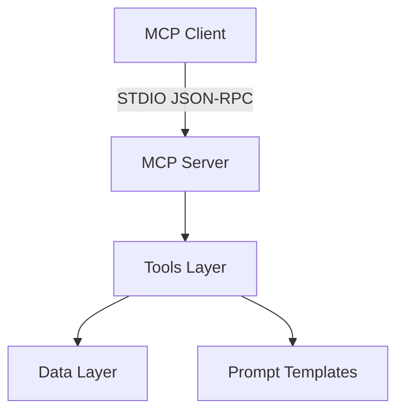
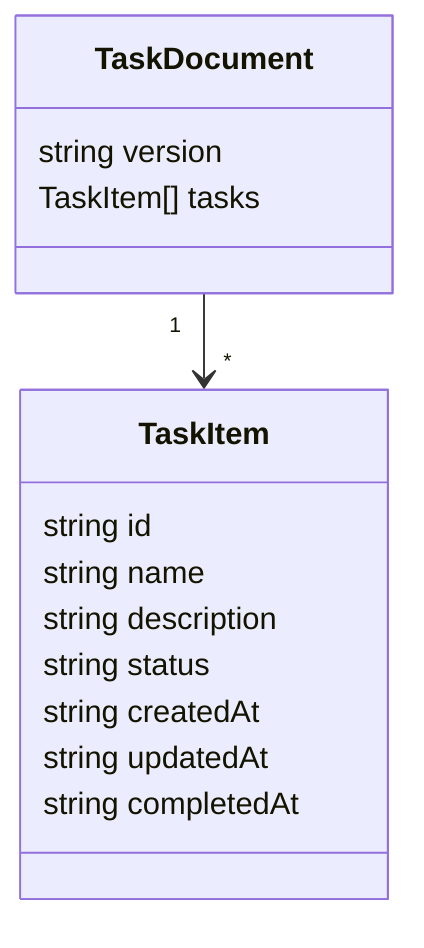

# Architecture

TaskFlow MCP is a local MCP server with a small, layered design.

## Layers

1. **Server**: MCP protocol handling and tool registration
2. **Tools**: business logic for task planning, workflow, and research
3. **Data**: task persistence and queries
4. **Prompts**: templates used by planning and research tools

## Data Model

Tasks are stored in a JSON document under the configured `DATA_DIR`. The schema is validated at runtime and includes fields for status, timestamps, dependencies, notes, and summaries.

## Transport

The server uses STDIO transport. Clients call `tools/list` to discover tools and `tools/call` to execute them.
