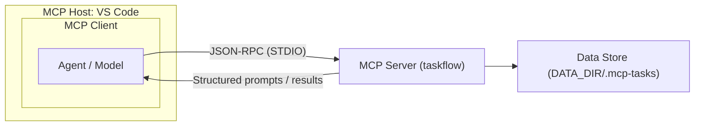

# MCP-Taskflow

## Summary
MCP-Taskflow adds a structured workflow layer on top of normal LLM chat. It provides **deterministic, structured prompts** for planning and research so the model produces more consistent and efficient output, and it **persists state across sessions** so agents can resume work without re-sending long context.

## Flow Diagram



## What This Means in Practice
- The **host** runs the MCP client and the model.
- The **client** calls MCP tools over JSON‑RPC via STDIO.
- The **server** validates inputs, builds structured prompts, and returns them to the client.
- The **data store** keeps task state across sessions so the agent can resume without context loss.

## Value Compared to No MCP Server (REBAC Example)
Long‑running work like “create a ReBAC system from scratch” benefits from persistent state and structured workflow.

**Without Taskflow (plain chat)**
Prompt:
```text
Create a ReBAC system from scratch.
```
Typical outcome:
- The model returns a large, one‑shot answer.
- No durable task list or dependencies.
- Hard to resume later without re‑explaining context.
- Team members have no shared, structured view of progress.

**With Taskflow (structured workflow)**
Prompt:
```text
Create a ReBAC system from scratch. Plan the work, split tasks, then execute and verify.
```
Typical outcome:
- The model generates a plan via `plan_task`.
- Tasks are created and tracked via `split_tasks` (with dependencies).
- Each task is executed and marked in progress via `execute_task`.
- Results are verified and scored via `verify_task`, with adjustments logged.
- State is persisted in the datastore, so anyone can `list_tasks` and `get_task_detail` to continue or review.

**Why this matters for teams**
- The task list, notes, and verification results are stored on disk and can be shared in the repo or a shared data directory.
- A teammate can open the same workspace and immediately see the current task state without reading long chat history.

**Dependency Management**
- Tasks can declare explicit prerequisites, so the agent knows what must happen first.
- Dependencies prevent blocked work: a task can’t be executed until its upstream tasks are complete.
- This makes long efforts like ReBAC safer: design → schema → policy engine → integration → tests becomes an enforced order, not a suggestion.
- Dependencies are stored with tasks, so any teammate can see the critical path and pick up the next unblocked item.
- For example: “Integrate with existing auth” cannot start until both “Define ReBAC model” and “Design storage layer” are completed.
